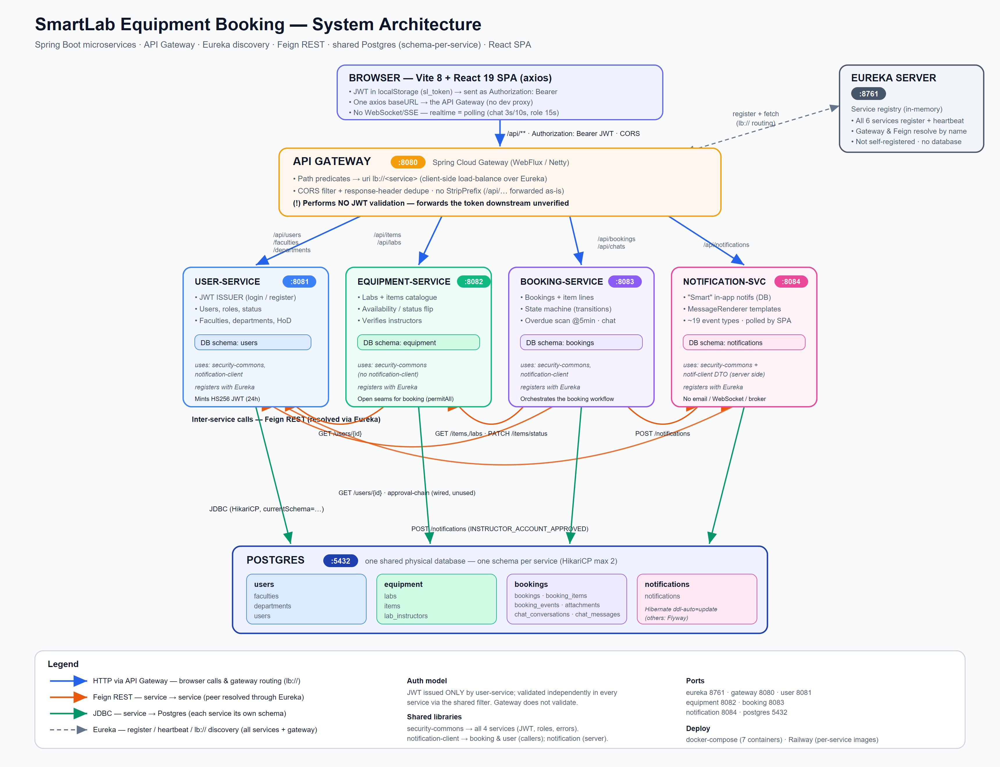

# Smart Lab — Equipment Booking

Spring Boot microservices backend with a Vite + React frontend for booking lab equipment. Six backend services register with Eureka and call each other via Feign; all services share one Supabase Postgres database (one schema per service: `users`, `equipment`, `bookings`, `notifications`). JWT authentication is handled by `user-service`.

## 1. Introduction

**SmartLab** is a web application that lets a university faculty manage the booking of lab
equipment online. Today students borrow equipment using paper forms and manual approvals.
SmartLab replaces that with a simple, role-based digital flow.

**Who uses it:**
- **Students** — browse equipment, add items to a cart, and request a booking.
- **Instructors / Lecturers / HoD (Head of Department)** — review and approve or reject
  requests, hand out equipment, and mark items returned.
- **Admins (Main Admin / Department Admin)** — manage users, labs, equipment, and departments.

**Core features:**
- User registration and login with JWT (JSON Web Token) security.
- An equipment catalogue with live availability (free / in use).
- A booking workflow with several approval steps (student → HoD → assigned handler).
- Automatic **overdue detection** for items not returned on time.
- A built-in **chat** between a student and the instructor for a booking.
- **Smart notifications** that tell each user what happened (submitted, approved, rejected,
  overdue, new chat message, etc.).

**Overall goal:** make equipment booking fast, transparent, and trackable, while keeping
each part of the system small, independent, and easy to maintain by using a
**microservices** design.

---

## 2. Architecture

### 2.1 Architecture diagram



📄 **Detailed Architecture Explanation:**  
[View ARCHITECTURE.md](ARCHITECTURE.md)

The **React app** in the browser sends every request to **one API Gateway**. The
gateway forwards each request to the correct **service**. Services find each other through the
**Eureka** registry and call each other with **Feign**. Every service stores its data in **one
shared PostgreSQL database**, but each service uses its **own schema** (its own set of tables).

### 2.2 Design decisions — why we split the application

We split the system into small services so that each one has **a single, clear job**. This
makes the code easier to understand, test, and deploy on its own.

| Service | Its job (why it is separate) |
|---|---|
| **user-service** | Owns people and the organisation (users, roles, faculties, departments). It is the **only** service that creates login tokens, so all identity logic lives in one place. |
| **equipment-service** | Owns the catalogue (labs and items) and their status. Keeping equipment data apart means the catalogue can change without touching bookings. |
| **booking-service** | Owns the booking process and its rules (the approval **state machine**, overdue checks, chat). This is the most complex logic, so it is isolated. |
| **notification-service** | Owns messages to users. Any service can send it an event; it decides the wording and stores the message. Copy/wording changes never touch other services. |
| **api-gateway** | One single entry door for the browser. It hides the internal services and handles CORS and routing. |
| **eureka-server** | A phone book so services can find each other by name instead of hard-coded addresses. |

Two shared **libraries** avoid copy-paste across services:
- **smartlab-security-commons** — JWT checking, user roles, and error handling (used by all 4
  services).
- **smartlab-notification-client** — the small Feign client and data shape used to send a
  notification (used by booking-service and user-service).

---

## 3. Microservices

### 3.1 Implementation methods (Netflix / Spring Cloud stack)

The backend is built with **Java 21 + Spring Boot 3.5** and the **Spring Cloud Netflix**
stack:

- **Netflix Eureka** — service discovery. Every service registers itself and looks up others
  by name.
- **Spring Cloud LoadBalancer** — client-side load balancing. The gateway and Feign use
  `lb://<service-name>` so requests are spread over all copies of a service.
- **Spring Cloud OpenFeign** — declarative REST clients. A service calls another by writing a
  simple Java interface (`@FeignClient`) instead of manual HTTP code. (Feign is set to use
  Apache HttpClient 5 so `PATCH` requests work.)
- **Spring Cloud Gateway** — the API gateway (built on reactive WebFlux / Netty).
- **Spring Security + JJWT** — token creation and validation.
- **Spring Data JPA + Flyway** — database access and versioned schema migrations.

### 3.2 Core services

> Note on security: JWT is created only by **user-service** at login. Every service then
> checks the token by itself using the shared filter. Some endpoints are left open
> (`permitAll`) on purpose so services can call each other (service-to-service auth is a later
> phase).

#### 3.2.1 user-service (port 8081, schema `users`)

**Functionality:** registration and login, JWT creation, and management of users, faculties,
departments, and the Head of Department.

**Sample REST endpoints:**

| Method | Path | Description |
|---|---|---|
| POST | `/api/users/register` | Register a new student or staff account (public). |
| POST | `/api/users/login` | Log in; returns a JWT plus user details (public). |
| GET | `/api/users/{id}` | Get a single user by id. |
| GET | `/api/users` | List users (admins only; department admins see their own department). |
| PATCH | `/api/users/{id}/assign-role` | Admin gives a real staff role (Instructor/Lecturer/HoD). |
| GET | `/api/departments/{id}/approval-chain` | Return the department's approver (HoD) for bookings. |

**Inter-service interaction:** when an admin approves a staff member, user-service **calls
notification-service** (Feign `POST /api/notifications`) to tell that person their account is
approved.

#### 3.2.2 equipment-service (port 8082, schema `equipment`)

**Functionality:** manage labs and items, item status (available / in use / maintenance), and
availability. It checks with user-service that a chosen lab instructor is real and active.

**Sample REST endpoints:**

| Method | Path | Description |
|---|---|---|
| POST | `/api/items` | Create a new equipment item (lab managers). |
| GET | `/api/items` | List items with optional filters (lab, status, category). |
| GET | `/api/items/{id}` | Get one item (open, so booking-service can read it). |
| PATCH | `/api/items/{id}/status` | Change an item's status (open, used by booking-service). |
| POST | `/api/labs` | Create a lab (admins). |
| GET | `/api/labs/{id}` | Get one lab (open for inter-service calls). |

**Inter-service interaction:** equipment-service **calls user-service** (Feign
`GET /api/users/{id}`) to verify that a lab's instructor exists and is active staff before
saving.

#### 3.2.3 booking-service (port 8083, schema `bookings`)

**Functionality:** the heart of the app. It creates bookings, runs the approval **state
machine**, prevents double-booking, flips item status, detects overdue items on a schedule,
and hosts the student–instructor **chat**.

**Sample REST endpoints:**

| Method | Path | Description |
|---|---|---|
| POST | `/api/bookings` | Student creates a booking with one or more items. |
| GET | `/api/bookings/mine` | The current student's own bookings. |
| GET | `/api/bookings/{id}/timeline` | The history (state changes) of a booking. |
| POST | `/api/bookings/{id}/items/{itemId}/transition` | One endpoint for every state change (approve, reject, collect, return, cancel). |
| GET | `/api/chats` | The current user's chat threads. |
| POST | `/api/chats/{conversationId}/messages` | Send a chat message. |

**Inter-service interaction:** booking-service is the busiest caller. It **calls
equipment-service** (get item, get lab, `PATCH` item status), **calls user-service** (get
names/emails for notifications and chat), and **calls notification-service** for every booking
and chat event (submitted, approved, rejected, overdue, new message, …).

#### 3.2.4 notification-service (port 8084, schema `notifications`)

**Functionality:** the "smart" notifier. It receives a typed event from another service, turns
it into a friendly **title + message** using a template registry (`MessageRenderer`, about 19
event types), saves it as an in-app notification, and lets the frontend read it back. It does
**not** send email or use WebSockets — the app polls it.

**Sample REST endpoints:**

| Method | Path | Description |
|---|---|---|
| POST | `/api/notifications` | Create a notification from an event (called by other services; open). |
| GET | `/api/notifications/user/{userId}` | List a user's notifications, newest first. |
| GET | `/api/notifications/user/{userId}/unread` | List a user's unread notifications. |
| PATCH | `/api/notifications/{id}/read` | Mark a notification as read. |
| DELETE | `/api/notifications/{id}` | Delete a notification. |

**Inter-service interaction:** notification-service is the **receiver** — it does not call other
services. booking-service and user-service call it.

### 3.3 Discovery Server (Eureka)

- **How services register:** each service includes the `spring-cloud-starter-netflix-eureka-client`
  dependency and sets one property:
  `eureka.client.service-url.defaultZone = http://<eureka-host>:8761/eureka/`. On startup the
  service sends its name (for example `booking-service`) and address to Eureka.
- **How Eureka monitors them:** each service sends a **heartbeat** every ~30 seconds to renew
  its lease. If Eureka stops receiving heartbeats, it removes that instance from the registry,
  so no one tries to call a dead service. You can see all registered services on the **Eureka
  dashboard** at `http://<eureka-host>:8761/`.
- The Eureka server itself does **not** register with anyone and has **no database** — it keeps
  the registry in memory.

### 3.4 API Gateway configuration

The gateway (**Spring Cloud Gateway**, port 8080) is the single door for the browser. Its main
settings:

- **Routes (path → service):**
  - `/api/users/**`, `/api/faculties/**`, `/api/departments/**` → `lb://user-service`
  - `/api/items/**`, `/api/labs/**` → `lb://equipment-service`
  - `/api/bookings/**`, `/api/chats/**` → `lb://booking-service`
  - `/api/notifications/**` → `lb://notification-service`
- **`lb://` load balancing** — the gateway asks Eureka for the service and spreads requests
  over its instances.
- **Discovery locator enabled** — it can also auto-create a route for any service in Eureka.
- **CORS** — configured in code so the browser (a different origin) can call the API; it allows
  the needed methods and exposes the `Authorization` header.
- **No `StripPrefix`** — the `/api/...` path is passed to services unchanged.
- **Overridable URLs** — booking and notification routes can point to a direct public URL
  (`BOOKING_SERVICE_URI`, `NOTIFICATION_SERVICE_URI`) for cloud setups that are not on Eureka.
- **Note:** the gateway does **not** validate the JWT; it forwards the token and each service
  validates it. (A known area to harden later.)

---

## 4. User Interface

### 4.1 Implementation details

- **Framework:** **React 19** built with **Vite 8** (a single-page application).
- **Routing:** `react-router-dom` v7 with role-based pages (student, instructor/lecturer/HoD,
  admin, staff).
- **HTTP:** **axios**, with one shared instance and a single base URL that points at the API
  gateway (`VITE_API_BASE`, defaults to `http://localhost:8080`).
- **Authentication in the UI:** after login the JWT is saved in the browser's `localStorage`.
  An axios **request interceptor** adds `Authorization: Bearer <token>` to every call. A
  **response interceptor** logs the user out and redirects to `/login` if the server replies
  `401`.
- **"Real-time" updates:** there are no WebSockets; the app **polls** — chat refreshes every
  3–10 seconds, and a waiting staff member's role is re-checked every 15 seconds.
- **State:** kept simple — session in `localStorage`, and a tiny publish/subscribe module for
  the shopping cart.

### 4.2 API testing (Postman)

The REST APIs were tested with **Postman** against the API gateway (`http://localhost:8080`),
so tests follow the same path as the real app.

Recommended, repeatable setup:

1. **Environment variables** — create a Postman environment with `baseUrl =
   http://localhost:8080` and an empty `token`.
2. **Login first** — send `POST {{baseUrl}}/api/users/login`. In the request's **Tests** tab,
   save the returned token:
   `pm.environment.set("token", pm.response.json().token);`
3. **Send the token automatically** — in the collection's **Authorization** tab choose
   *Bearer Token* and set it to `{{token}}`, so every request is authenticated.
4. **Test each service** through the gateway, for example:
   - `GET {{baseUrl}}/api/items` (list equipment)
   - `POST {{baseUrl}}/api/bookings` (create a booking, with a JSON body)
   - `POST {{baseUrl}}/api/bookings/{id}/items/{itemId}/transition` (approve/reject/return)
   - `GET {{baseUrl}}/api/notifications/user/{userId}` (check notifications appear)
5. **Check status codes and bodies** with Postman test scripts (for example, expect `200`/`201`
   on success and `401` when no token is sent). Grouping requests into one **collection** lets
   the whole flow (register → login → book → approve → notify) be run in order.

---

## 5. Deployment

### 5.1 Run locally with the terminal (no Docker)

Prerequisites: **JDK 21**, **Maven**, **Node.js**, and a running **PostgreSQL** (create a
database `smartlab`).

1. Start services **in order** (each in its own terminal), or build first with
   `mvn clean package` and run the jars:
   ```
   # 1) discovery first
   cd eureka-server && mvn spring-boot:run
   # 2) then the services (set DB_URL, DB_USERNAME, DB_PASSWORD, JWT_SECRET as env vars)
   cd user-service && mvn spring-boot:run
   cd equipment-service && mvn spring-boot:run
   cd booking-service && mvn spring-boot:run
   cd notification-service && mvn spring-boot:run
   # 3) gateway last
   cd api-gateway && mvn spring-boot:run
   ```
2. Start the frontend:
   ```
   cd frontend
   npm install
   npm run dev
   ```
3. Open the app (Vite dev URL) — it talks to the gateway at `http://localhost:8080`.

### 5.2 Run locally with Docker (recommended)

The project ships a `docker-compose.yml` that runs Postgres, Eureka, the four services, and the
gateway together on one network.

```
# from the Equipment_booking_hosting folder
docker compose up --build
```

- Postgres starts first (with a health check); then Eureka; then the four services; then the
  gateway.
- Services find each other by container name (`postgres:5432`, `eureka-server:8761`).
- Provide secrets via a `.env` file (`DB_PASSWORD`, `JWT_SECRET`, admin seed values).
- The frontend is run separately (`cd frontend && npm run dev`).
- To reset the database: `docker compose down -v` (this deletes the data volume).

### 5.3 Deploy to the cloud (production)

**Backend — Railway (or any container host):**
- Deploy each service from its **Dockerfile** as its own container. Deploy **Postgres first**
  (with a persistent volume), then **eureka-server**, then the four services, then the
  **api-gateway** (the only one with a public domain).
- Optionally use `combined-services/Dockerfile` to run equipment + booking + notification in a
  **single** container to save resources.
- Set environment variables per service: `EUREKA_URL`, `DB_URL`, `DB_USERNAME`, `DB_PASSWORD`,
  `JWT_SECRET` (must be the **same** for all services), and on Railway
  `EUREKA_PREFER_IP=false` with `EUREKA_INSTANCE_HOSTNAME=<service>.railway.internal`.

**Frontend — Vercel (or Netlify):**
- https://equipment-booking-omega.vercel.app
- Build the React app and set `VITE_API_BASE` to the **public gateway URL**.

---

## 6. Source Code

### 6.1 GitHub repository

- **Main development repo:** https://github.com/RubithaR/Equipment_booking

### 6.2 Development challenges and how they were solved

| Challenge | How it was solved |
|---|---|
| **Shared database, separate ownership** — one Postgres but data must stay separated per service. | Gave each service its **own schema** (`users`, `equipment`, `bookings`, `notifications`) using `currentSchema=` in the JDBC URL, so services never touch each other's tables. |
| **Creating tables safely** — different tools per service. | Used **Flyway** migrations for users/equipment/bookings, and made sure all four schemas are pre-created at database start (an init SQL script) because notification-service builds its table with Hibernate. |
| **Services finding each other in the cloud** — fixed addresses don't work on Railway's private network. | Used **Eureka** with fully **environment-driven** settings (`EUREKA_URL`, hostnames, IPv6 wildcard binding) so the same code runs locally, in Docker, and on Railway. |
| **Feign `PATCH` requests failing** — the default HTTP client doesn't support `PATCH` well. | Switched Feign to **Apache HttpClient 5**, which fixed status-update calls to equipment-service. |
| **Database connection limits** (Supabase free tier). | Kept **HikariCP pools very small** (max 2), and later moved from Supabase to an **own Postgres container** to remove the limit — Supabase now only seeds sample data. |
| **CORS errors** — browser and gateway are different origins. | Added a **CORS filter** at the gateway (allowed methods, credentials, expose `Authorization`) and de-duplicated CORS headers. |
| **Complex approval rules** — many states and roles. | Built a small **state machine** (`TransitionEngine`) with one endpoint and typed transitions, instead of many separate endpoints, which kept the rules in one place. |
| **Sharing security code across services.** | Put JWT, roles, and error handling into a **shared library** (`smartlab-security-commons`) so every service behaves the same way and uses the same `JWT_SECRET`. |


## Services and ports

| Service                | Port  | Container             |
| ---------------------- | ----- | --------------------- |
| `eureka-server`        | 8761  | `smartlab-eureka`     |
| `api-gateway`          | 8080  | `smartlab-gateway`    |
| `user-service`         | 8081  | `smartlab-user`       |
| `equipment-service`    | 8082  | `smartlab-equipment`  |
| `booking-service`      | 8083  | `smartlab-booking`    |
| `notification-service` | 8084  | `smartlab-notification` |
| `frontend` (Vite)      | 5173  | run on host           |

Eureka dashboard: <http://localhost:8761>. Gateway entry point: <http://localhost:8080>.


## Run the backend (Docker Compose)

```bash
docker compose up --build         # build + start all six services
docker compose up                 # start without rebuilding
docker compose down               # stop and remove containers
docker compose down -v            # also remove the network/volumes
docker compose logs -f            # tail logs from every service
docker compose logs -f user-service
docker compose restart booking-service
docker compose ps                 # see what's running
```

Wait for `eureka-server` to log "Started EurekaServerApplication" before the others finish registering. The first build pulls Maven + JDK images and takes a few minutes; subsequent builds are cached.

## Run the frontend

```bash
cd frontend
npm install
npm run dev                       # http://localhost:5173
npm run build                     # production bundle
npm run lint
```

The frontend talks to the gateway at `http://localhost:8080` by default.

## Common workflows

Rebuild a single service after a code change:

```bash
docker compose up --build user-service
```

Shell into a running container:

```bash
docker exec -it smartlab-user sh
```

Stop everything and free all ports:

```bash
docker compose down
```

## Troubleshooting

**`Bind for 0.0.0.0:8761 failed: port is already allocated`** — something else is bound to a port Compose needs. Find it and stop it:

```bash
lsof -nP -iTCP:8761 -sTCP:LISTEN              # which process holds the port
docker ps --filter "publish=8761"             # is another container holding it
docker stop <container-name-or-id>
```

A frequent cause is a previously launched single-image container (built from an older root `Dockerfile`) still running with all six service ports published. Stop that container before running `docker compose up`.

**Service shows up in Eureka but Feign calls fail** — the gateway and services resolve each other by service name on the `smartlab` Docker network. If you run a service outside Compose, point it at `http://localhost:8761/eureka/` and make sure it registers with a host the others can reach.

**DB connection errors** — confirm `DB_PASSWORD` in `.env` matches the current Supabase password (Project Settings → Database). Compose only reads `.env` at `up` time; restart the stack after editing.

## Project layout

```
.
├── docker-compose.yml        # six-service local dev stack
├── .env.example              # template for DB_PASSWORD and overrides
├── eureka-server/            # service registry
├── api-gateway/              # Spring Cloud Gateway, single entry point
├── user-service/             # auth, JWT, user CRUD
├── equipment-service/        # equipment catalog
├── booking-service/          # bookings, calls equipment + user via Feign
├── notification-service/     # email/notification dispatch
└── frontend/                 # Vite + React client
```

Each backend service has its own `Dockerfile` (multi-stage Maven build → JRE runtime) and its own `application.properties` under `src/main/resources/`.
